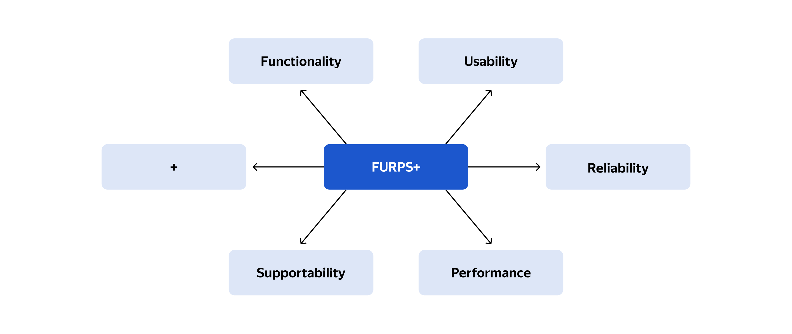

# Задание 2. FURPS+ таблица
 
Команда цифровой трансформации начала процесс цифровизации депозитного направления бизнеса. Предполагается, что клиенты смогут подавать заявки на депозиты в интернет-банке и на сайте. Сейчас мы рассматриваем только вариант с реализацией MVP. 

В ходе общения с представителями бизнеса и IT-командами вы получили такую информацию:

1. На сайте новый клиент видит список доступных депозитов с актуальными ставками. Клиент может подать заявку на депозит, оставив свой номер телефона и Ф. И. О. После этого ему позвонит менеджер кол-центра. Изучив заявку в системе кол-центра, менеджер может предложить особые условия. После звонка новому клиенту надо прийти в отделение для идентификации, поскольку банки не могут принимать новых клиентов без личной проверки документов. Стоит учитывать, что с сайта передаётся чувствительная информация. Данные необходимо защищать с помощью механизма шифрования трафика.

2. В интернет-банке клиент видит список доступных депозитов с актуальными ставками и персонализированные ставки лично для него. Указав счёт и сумму депозита, он может подать заявку на открытие депозита. Операцию необходимо будет подтвердить с помощью СМС-кода. Функционал работы с СМС реализован в ядре системы. Он требует доработки со стороны подрядчика, но этого лучше избежать. Реализовать такой бизнес-функционал можно силами команды разработки банка. Нужно учесть, что ставки по депозитам сейчас не ведутся нигде, кроме XLS-файлов. С ними должны иметь возможность работать сотрудники как бэк-офиса депозитов, так и бэк-офиса кредитов. Возможно, эту функциональность стоит реализовать в АБС, как и весь текущий процесс согласования ставки по заявке. В интернет-банке данные при передаче также надо защитить каким-то механизмом шифрования.

3. При доработках во всех системах нужно как можно больше использовать технологии, которые уже есть в банке. Например, базы данных MS SQL и Oracle. Можно развернуть новые технологии, но необходимо, чтобы они были совместимы с существующими платформами разработки. Также желательно, чтобы внутри банка уже была экспертиза — сотрудники понимали новые технологии хотя бы на уровне языков программирования. Если нужны очереди сообщений, то лучше использовать Kafka на перспективу. Правда, стоит учитывать, что текущая версия платформы интернет-банка несовместима с ней. Возможно, стоит подумать о переводе интернет-банка на микросервисную архитектуру, но пока только в рамках задачи открытия депозитов. Также нужно предусмотреть разработку документации для дальнейшего расширения системы.

4. На этапе MVP предполагается, что заявку на открытие депозита обработает менеджер в бэк-офисе. Он подтвердит условия депозита в АБС банка. При этом клиент должен получить СМС-уведомления после подтверждения размера ставки и открытия депозита.

5. Бизнес ожидает, что интерфейс работы будет максимально удобным для клиента. Отклик по всем операциям должен быть максимально быстрым и занимать миллисекунды. Сейчас с этим есть проблема: при проведении платежей некоторые справочные данные загружаются больше секунды. Хочется это исправить. Также нужно придерживаться системы дизайна для приложений, которая принята в компании. Пользователи при работе должны видеть привычные цвета и брендированные элементы.

6. Команда АБС утверждает, что база данных системы уже перегружена. Онлайн-подача заявок на большое количество продуктов может поставить под угрозу работоспособность банка. При этом все сервисы должны работать 24/7 и быть доступны в 99,9% случаев, поэтому лучше избежать прямой работы интернет-банка с API АБС в новом процессе. Требования доступности относятся и к интернет-банку: в случае сбоев в ЦОД необходимо, чтобы сервисы интернет-банка были доступны и выдерживали требуемую нагрузку. Команда интернет-банка утверждает, что эти требования пока невыполнимы. Сейчас в интернет-банке мало клиентов — даже если произойдёт сбой и интернет-банк не будет работать целый день, это не принесёт проблем. Фактически всё работает в одном ЦОД на одной группе серверов. У банка есть резервный ЦОД, в случае сбоя можно переключиться на него. Также лучше предусмотреть равномерное горизонтальное масштабирование и распределение запросов между серверами, приложениями и ЦОД. Но нужно учитывать, что АБС может масштабироваться только вертикально из-за своей базы данных.

## Что нужно сделать
Команда трансформации просит вас обобщить весь набор требований в формате FURPS+ таблицы:

1. Выделите архитектурно-значимые требования. В ходе работы учитывайте не только контекст из задания, но и информацию о системах компании из блока «IT-ландшафт компании».

2. По возможности добавьте дополнительные требования, которые кажутся вам важными и могут повлиять на решение. Напишите обоснование для таких требований в поле «Комментарий».

## Модель описания требований FURPS+

Функциональные и нефункциональные требования удобно описывать по модели FURPS+. Её применяют в заказной разработке, когда набор требований заранее согласуется с заказчиком и включается в план реализации проекта.

- Функциональные (Functionality, F) — то, что система должна выполнять на релизе.

- Удобство использования (Usability, U) — правила, по которым система взаимодействует с пользователем. Это могут быть UX/UI-дизайн, правила работы интерфейса для людей с ограниченными возможностями, справочная информация по работе с системой.

- Надёжность (Reliability, R) — всё, что относится к работоспособности системы: время простоя в случае сбоя, режим работы, график обслуживания. Обычно невозможно сделать систему устойчивой в любой ситуации, поэтому сразу важно заложить ограничения.

- Производительность (Performance, P) — всё, что относится к быстродействию и потреблению ресурсов: время отклика, масштабирование системы, число одновременных пользователей.

- Поддерживаемость (Supportability, S) — возможность и правила тестирования, параметры  расширения и доработки системы.

- Ограничения (остальное со знаком +) — это дополнительные ограничения, которые мы накладываем на систему: языки программирования, правила проектирования, применение определённых баз данных.

## Решение

[Смотри схему FURPS+](./FURPS.md)
