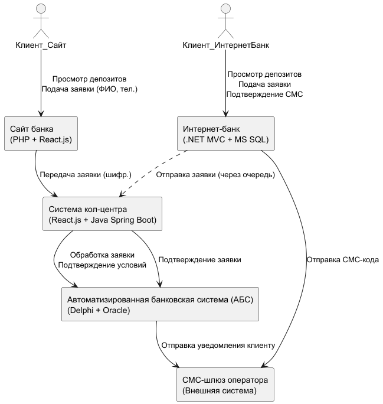
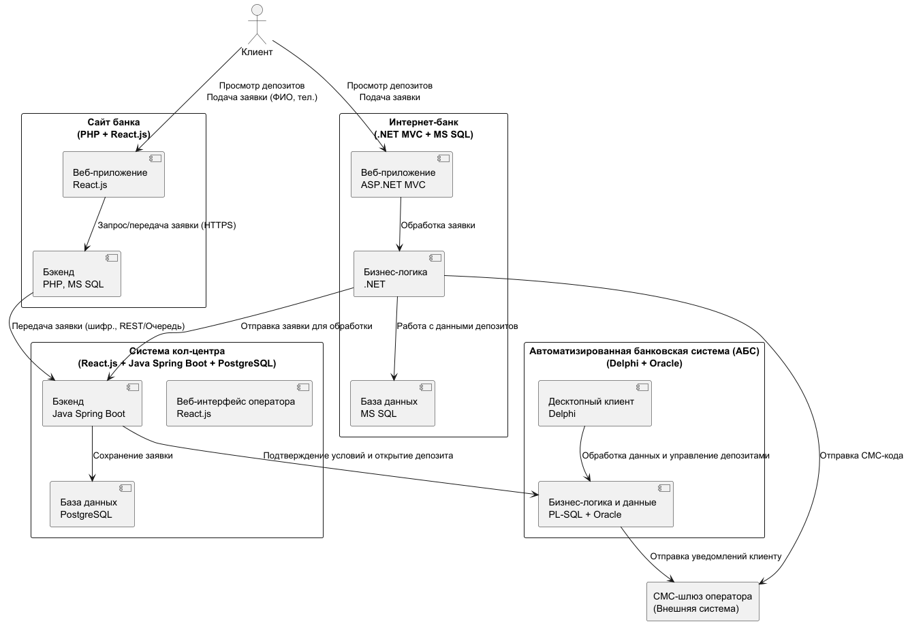

# Задание 3. Открытие депозитов онлайн
 
С вашей помощью команда цифровой трансформации согласовала требования. Теперь нужно определить сроки реализации и стоимость. Этим займётся уже менеджер проекта.

И всё же пока что общая архитектура MVP ясна не до конца. Хочется понять, какие IT-команды должны участвовать в разработке и как разные системы будут взаимодействовать друг с другом.

## Что нужно сделать

Подготовьте схему концептуальной архитектуры открытия депозитов для MVP в формате ADR. В качестве исходных данных используйте:
- Описание требований, которые у вас получились во втором задании.
- Описание технологий, систем и процессов из всего текста проектной работы.
- Описание процессов открытия депозитов, которые мы привели в первом и втором заданиях.

## Решение

- [Смотри решение в формате ADR](./ADR.md)
- [Смотри диаграмму контекста в модели C4](./c4-context-schema.puml)
- [Смотри диаграмму контейнеров в модели C4](./c4-container-schema.puml)

